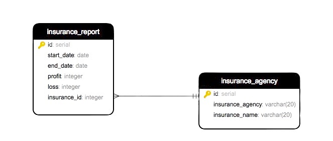
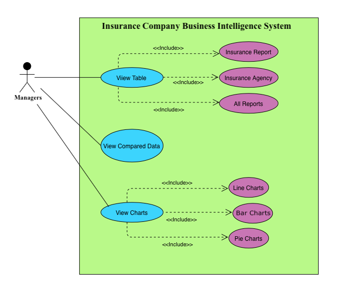
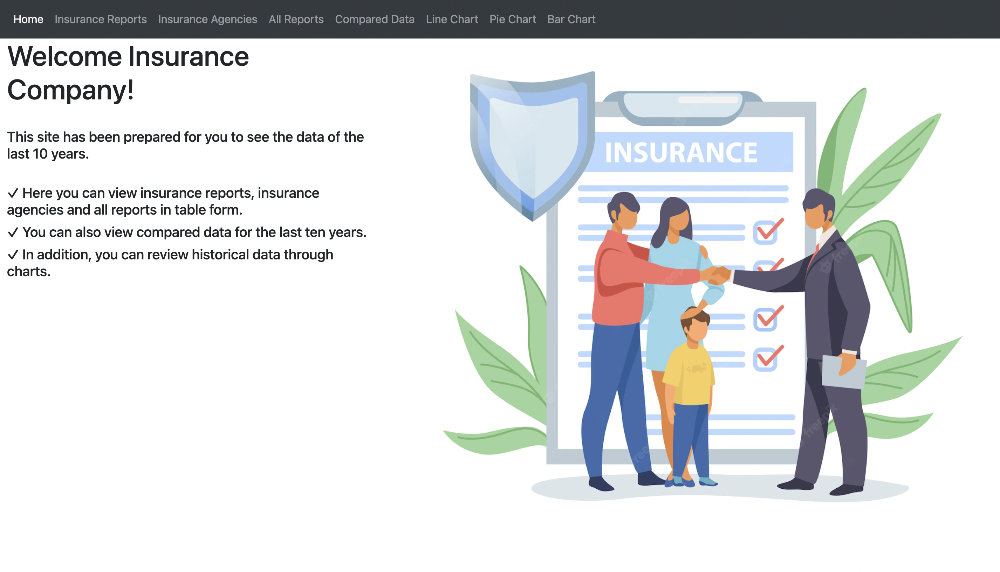
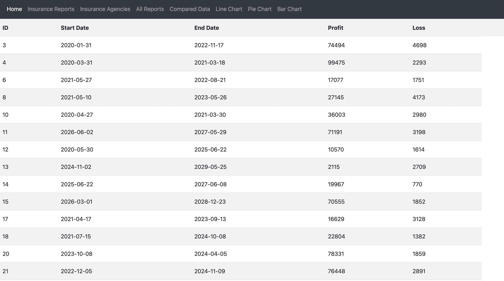
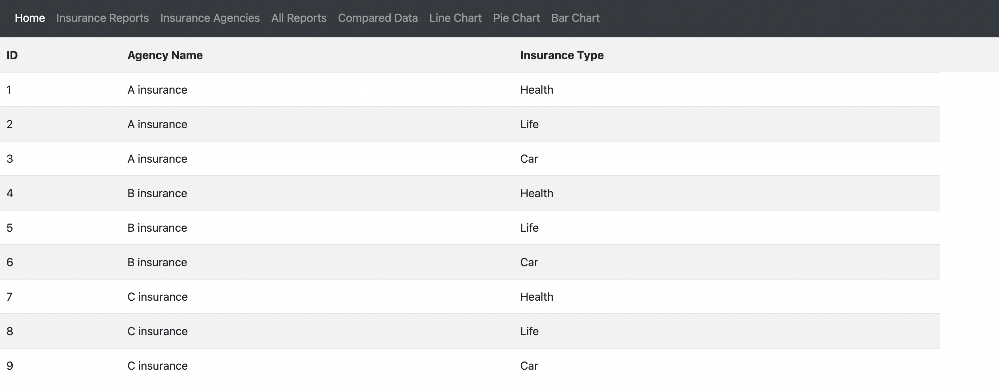
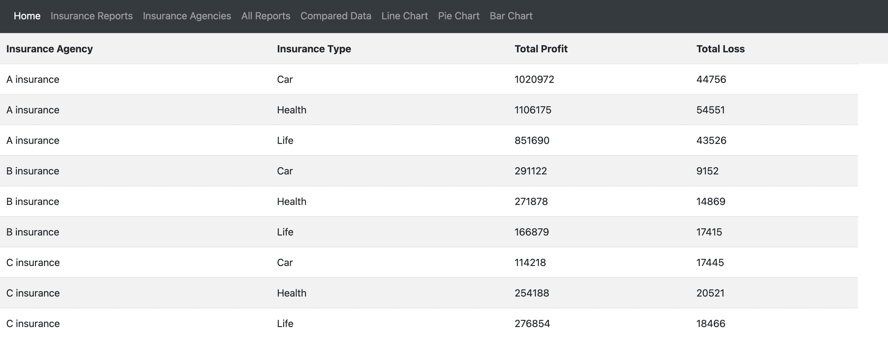
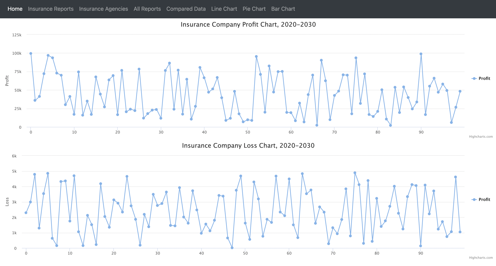
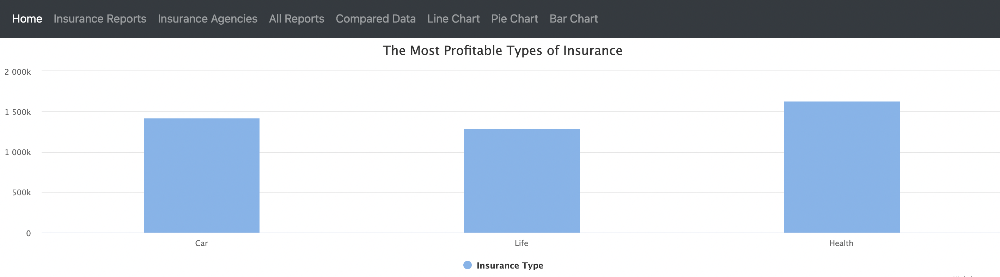

# Insurance Company Business Intelligence System

## Description

This project is a business intelligence application designed for managers working in an insurance company.

Managers through the system:

- Can view insurance reports, insurance agents and all reports in table form
- Can view compared data for the last ten years
- Can view historical data through graphs

## ER Diagram

- start_date : start date of insurance
- end_date : end date of insurance
- profit : total premium paid by the customer
- loss : total costs covered by insurance
- insurance_agency : agency name with which the insurance company is contracted
- insurance_name : types of insurance made by insurance agents

## Use Case Diagram

## Home Page

## Insurance Reports

## Insurance Agencies

## All Reports

## Compared Data

## Line Chart

## Pie Chart

## Bar Chart

## Tools Needed

- Java
- Spring Boot
- JPA-Hibernate
- Postgresql
- Junit
- Thymeleaf
- HTML,CSS,Javascript

## Notes

You can find the required sql queries under SqlQueries/InsuranceCompanySql.
Since the data is updated while developing, the results will not be exactly the same.

